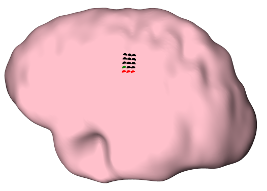
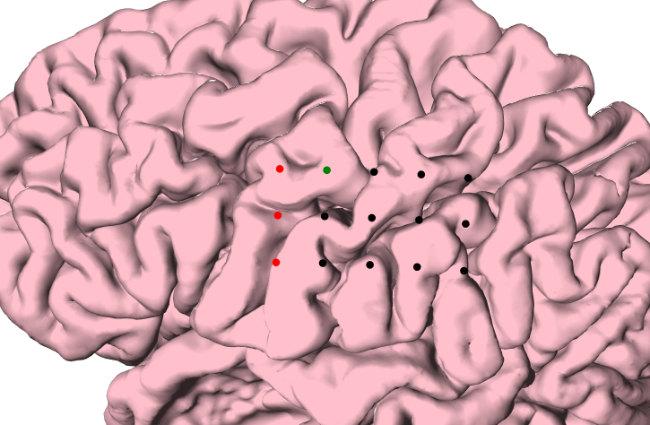
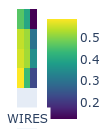
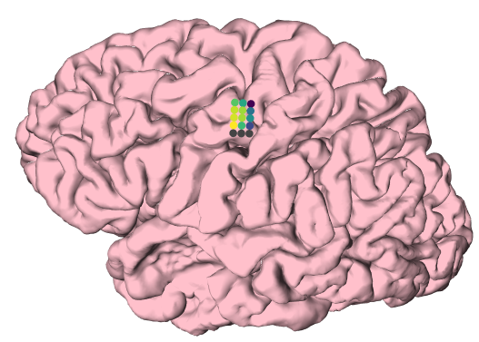
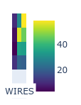
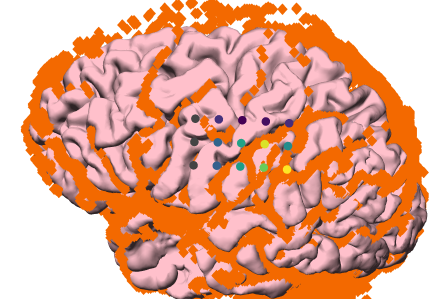
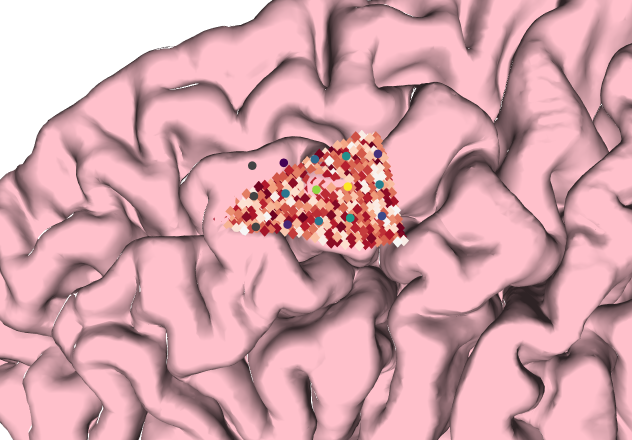

# GRIDGEN

See [documentation](https://gpiantoni.github.io/gridgen) for instructions on how to install or follow the [tutorial](https://gpiantoni.github.io/gridgen/tutorial.html).

## Quick Start

### Grid Creation
This pure-python3 package will allow you to create 3D meshes onto the convex hull (dura surface):

You can rotate the grid:

or change the inter-electrode distance:

### Grid Fitting
You can also use the information from the pial surface (mesh) to compute the distance to the electrodes, in different ways:

This information can be used to fit the ECoG values onto the most likely area of the brain where the grid was placed.

You can compute the spatial correlation between electrodes and voxels from an fMRI:

and based on some fMRI activity, the script will find the location where it can record the highest amount of fMRI activity:

## References
  - [Piantoni, G et al. *"Size of the spatial correlation between ECoG and fMRI activity."* *NeuroImage* 242(2021): 118459](https://doi.org/10.1016/j.neuroimage.2021.118459)
  - [Branco, MP et al. *"GridLoc: An automatic and unsupervised localization method for high-density ECoG grids."* *NeuroImage* 179(2018): 225-234](https://doi.org/10.1016/j.neuroimage.2018.06.050)
