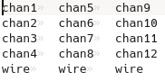
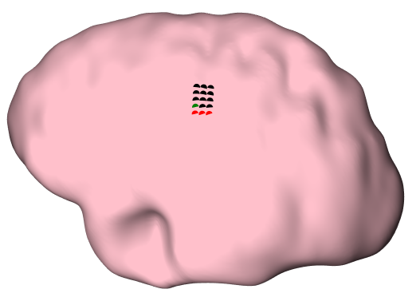

# Tutorial
**gridgen** consists of some functions (commands) that allow you to:
  - create the 2d grid (`grid2d`)
  - create the 3d grid (`grid3d`)
  - compute the power spectral density (PSD) at each electrode (`ecog`)
  - fit the 3d grid onto the surface, by fitting the ecog values (`fit`)
  - compare the results (`matlab`)

In addition, you need to pass the parameters for your analysis.
Parameters are structured in a json format.
A description of the parameters can be found in [Parameters](parameters.md).

You can also generate an template `json` file with all the necessary parameters with the command:

```bash
gridgen parameters.json parameters
```

Then you need to populate the values in parameters.
Note that each command requires different set of parameters. f.e.

```bash 
gridgen parameters.json grid2d
```

only requires the parameter `grid2d` while the command:

```bash 
gridgen parameters.json grid3d
```

requires the parameters `grid3d`, `mri`, `initial` (and possibly `morphology` and `functional`).
This information is described in [Parameters](parameters.md) and `gridgen` will throw an error if the parametes are not complete.

## grid2d
The first step is to create a 2d grid.
This grid will only give us the electrode labels and no additional information (so, no information about electrode spacing).
You can create a grid with the parameters (called `parameters.json`):

```json
{
  "grid2d": {
    "n_rows": 4,
    "n_columns": 3,
    "direction": "TBLR",
    "chan_pattern": "chan{}"
    }
}
```

By convention, the wires are at the bottom. 
`chan_pattern` is used to generate the channel labels. 
`chan{}` will create `chan1`, `chan2`, `chan3` and `chan{:03d}` will create `chan001`, `chan002`, `chan003` (see [Python string formatting](https://docs.python.org/3/library/string.html#formatspec)).

The command

```bash 
gridgen parameters.json grid2d
```

will create a file called `grid2d_labels.tsv` like this:



This file will be used by the other commands (`ecog`, `grid3d`, `fit`).

Note that you can modify this text file as you want (f.e. by moving the channels around, in case the grid labels are in a different order).

## grid3d
After having created `grid2d_labels.tsv`, you can create a 3d grid, onto the smooth surface (convex hull).
You'll need to pass additional parameters.
At the minimum, you need to specifiy:

```json
{
  "grid3d": {
    "interelec_distance": 3,
    "maximum_angle": 5
    },
  "mri": {
    "T1_file": "/home/giovanni/tools/gridgen/tests/analysis/data/brain.mgz",
    "dura_file": "/home/giovanni/tools/gridgen/tests/analysis/data/lh_smooth.pial"
  },
  "initial": {
    "label": "chan4",
    "RAS": [-47, -1, 3],
    "rotation": 0
  }
}
```

The command

```bash 
gridgen parameters.json grid3d
```

will create a folder with:

  - `electrodes.tsv` : electrode locations in T1 space
  - `electrodes.label` : electrode locations for freeview
  - `electrodes.fcsv` : electrode locations for 3DSlicer
  - `electrodes.html` : interactive plot with electrode locations

which looks like this:


