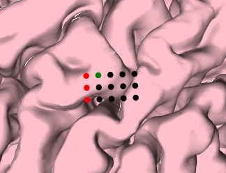
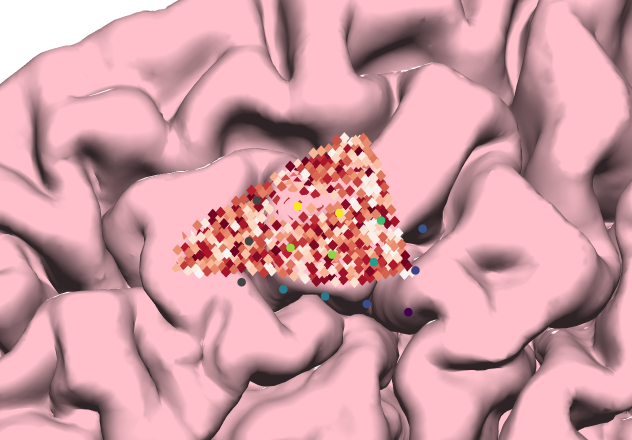

# Tutorial
**gridgen** consists of some functions (commands) that allow you to:
  - create the 2d grid (`grid2d`)
  - create the 3d grid (`grid3d`)
  - compute the power spectral density (PSD) at each electrode (`ecog`)
  - fit the 3d grid onto the surface, by fitting the ecog values (`fit`)
  - compare the results (`matlab`)

In addition, you need to pass the parameters for your analysis.
Parameters are structured in a json format.
A description of the parameters can be found in [Parameters](parameters.md).

You can also generate an template `json` file with all the necessary parameters with the command:

```bash
gridgen parameters.json parameters
```

Then you need to populate the values in parameters.
Note that each command requires different set of parameters. f.e.

```bash 
gridgen parameters.json grid2d
```

only requires the parameter `grid2d` while the command:

```bash 
gridgen parameters.json grid3d
```

requires the parameters `grid3d`, `mri`, `initial` (and possibly `morphology` and `functional`).
This information is described in [Parameters](parameters.md) and `gridgen` will throw an error if the parametes are not complete.

## grid2d
The first step is to create a 2d grid.
This grid will only give us the electrode labels and no additional information (so, no information about electrode spacing).
You can create a grid with the parameters (called `parameters.json`):

```json
{
  "grid2d": {
    "n_rows": 4,
    "n_columns": 3,
    "direction": "TBLR",
    "chan_pattern": "chan{}"
    }
}
```

By convention, the wires are at the bottom. 
`chan_pattern` is used to generate the channel labels. 
`chan{}` will create `chan1`, `chan2`, `chan3` and `chan{:03d}` will create `chan001`, `chan002`, `chan003` (see [Python string formatting](https://docs.python.org/3/library/string.html#formatspec)).

The command

```bash 
gridgen parameters.json grid2d
```

will create a file called `grid2d_labels.tsv` like this:


This file will be used by the other commands (`ecog`, `grid3d`, `fit`).

Note that you can modify this text file as you want (f.e. by moving the channels around, in case the grid labels are in a different order).

## grid3d
After having created `grid2d_labels.tsv`, you can create a 3d grid, onto the smooth surface (convex hull, dura surface).
You'll need to pass additional parameters.
At the minimum, you need to specifiy:

```json
{
  "grid3d": {
    "interelec_distance": 3,
    "maximum_angle": 5
    },
  "mri": {
    "T1_file": "analysis/data/brain.mgz",
    "dura_file": "analysis/data/lh_smooth.pial"
  },
  "initial": {
    "label": "chan4",
    "RAS": [-47, -1, 3],
    "rotation": 0
  }
}
```

`initial` indicates which electrode should be used as starting point and you should specify the (rough) RAS coordinates of that electrode.
The command

```bash 
gridgen parameters.json grid3d
```

will look for the closest vertex on the smooth surface (start electrode).
Starting from the start electrdoe (green), the locations for the other electrodes are created one at the time, according to this idea:


  1. Start electrode (which is at the exact location as the vertex on the smooth surface, and with the same normal)
  2. Find the next electrode (based on the normal of the start electrode and the `rotation` parameter, where 0 is roughtly upwards). The next electrode should also be on the smooth surface.
  3. Continue finding the next electrode on the same column, following the same line (the position of the new electrode follows the normal from the green electrode and the first black electrode, until it touches the smooth surface or it reaches the `maximum_angle`).
  4. Find electrodes along the rows. The angle between black-green and blue-green should be roughly 90° but not necessary.
  5. Find the electrode at the intersection between the other two electrodes. The constraint is that the two arrows have the same length (but the angle might not be 90°).

The output is a folder with:

  - `electrodes.tsv` : electrode locations in T1 space
  - `electrodes.label` : electrode locations for freeview
  - `electrodes.fcsv` : electrode locations for 3DSlicer
  - `electrodes.html` : interactive plot with electrode locations

which looks like this:


### Morphology (pial surface)
You can also add the pial surface. 
The plot will use the pial surface and will compute the morphology:

```json
{
  "grid3d": {
    "interelec_distance": 3,
    "maximum_angle": 5
    },
  "mri": {
    "T1_file": "analysis/data/brain.mgz",
    "dura_file": "analysis/data/lh_smooth.pial"
    "pial_file": "analysis/data/lh.pial"
  },
  "initial": {
    "label": "chan4",
    "RAS": [-47, -1, 3],
    "rotation": 0
  },
  "morphology": {
    "distance": "ray",
    "penalty": 2
  }
}
```

which looks like:


and it will compute the morphology:


The `distance` can be:
  - `ray` : distance between electrode and the intersection of the normal of the electrode and the pial surface
  - `minimum` : distance between electrode and closest vertex on the pial surface
  - `view` : distance between electrode and closest vertex inside a cone (angle of the cone: 30°)
  - `cylinder` : distance between electrode and closest vertex inside a cylinder (electrode is the center)
After computing the distance, you can specify `penalty`, which is the exponent when computing the penalty from the distance. Morphology = 1 / distance<sup>penalty</sup>. More simply, 1 = activity decreases linearly with distance; 2 = activity decreases with the square of the distance.

`distance` can also be `pdf`, where the value associated with each electrode with the weighted sum of the distance of all the vertices on the pial surface, weighted by a gaussian 3d smoothing kernel. 
`penalty` in this case refers to the sigma of the 3D smoothing kernel.

### Rotation
The orientation when `rotation = 0` is roughly upwards (inferior-superior axis). 
It might not always follow this axis exactly (it's just a convention), so try different `rotation` values to see the orientation that you want.
You can then add rotation (in degrees, clockwise):

```json
{
  "grid3d": {
    "interelec_distance": 3,
    "maximum_angle": 5
    },
  "mri": {
    "T1_file": "analysis/data/brain.mgz",
    "dura_file": "analysis/data/lh_smooth.pial"
    "pial_file": "analysis/data/lh.pial"
  },
  "initial": {
    "label": "chan4",
    "RAS": [-47, -1, 3],
    "rotation": 90
  },
  "morphology": {
    "distance": "ray",
    "penalty": 2
  }
}
```



The start electrode is shown in green, the other electrodes are in black and the wires are in red.

### Inter-electrode Distance
You can also change the distance between electrodes:

```json
{
  "grid3d": {
    "interelec_distance": 10,
    "maximum_angle": 5
    },
  "mri": {
    "T1_file": "analysis/data/brain.mgz",
    "dura_file": "analysis/data/lh_smooth.pial",
    "pial_file": "analysis/data/lh.pial"
  },
  "initial": {
    "label": "chan4",
    "RAS": [-47, -1, 3],
    "rotation": 90
  },
  "morphology": {
    "distance": "ray",
    "penalty": 2
  }
}
```


### Grid Rigidity

You can also modify the rigidity of the grid, which is controlled by the `maximum_angle` parameter (i.e. the maximum angle between two neighboring electrodes).

```json
{
  "grid3d": {
    "interelec_distance": 10,
    "maximum_angle": 5
    },
  "mri": {
    "T1_file": "analysis/data/brain.mgz",
    "dura_file": "analysis/data/lh_smooth.pial",
    "pial_file": "analysis/data/lh.pial"
  },
  "initial": {
    "label": "chan4",
    "RAS": [-18, -81, -31],
    "rotation": 90
  },
  "morphology": {
    "distance": "ray",
    "penalty": 2
  }
}
```


### Functional Data (Angiogram)
In addition to the morphology (based on a mesh), you can calculate some metrics at each electrode based on a 3D MRI volume.
The MRI volume can be an angiogram (which gives you the location of the blood vessels) or a t-map with activity at each voxel, so that you can combine fMRI results with the ECoG electrodes.

### Angiogram
First, make sure that the angiogram is realigned to the T1 (see [Preparation](preparation.md)).
Then you specify the parameters in `functional`. 
In this case, you only include voxels above 90 (all the voxels above the threshold are given a value of 1 and those below the threshold are given a value of 0).
Then you compute the number of voxels in a sphere of a radius of 8mm around each electrode:

```json
{
  "grid3d": {
    "interelec_distance": 10,
    "maximum_angle": 5
    },
  "mri": {
    "T1_file": "analysis/data/brain.mgz",
    "dura_file": "analysis/data/lh_smooth.pial",
    "pial_file": "analysis/data/lh.pial",
    "func_file": "analysis/data/angiogram.nii.gz"
  },
  "initial": {
    "label": "chan4",
    "RAS": [-47, -1, 3],
    "rotation": 90
  },
  "morphology": {
    "distance": "ray",
    "penalty": 2
  },
  "functional": {
    "threshold": 90,
    "metric": "sphere",
    "kernel": 8
  }
}
```

The output will also return a plot called `functional.html` which shows the angiogram and the values for each electrode:


### fMRI
If you have the results of the fMRI as t-maps, you can compute the weighted 3D average, based on a 3D gaussian weighting kernel, as described in [Piantoni, G. et al. *"Size of the spatial correlation between ECoG and fMRI activity."* *NeuroImage* 242(2021): 118459](https://doi.org/10.1016/j.neuroimage.2021.118459) .

Note that we do not binarize the MRI in this case.

```json
{
  "grid3d": {
    "interelec_distance": 10,
    "maximum_angle": 5
    },
  "mri": {
    "T1_file": "analysis/data/brain.mgz",
    "dura_file": "analysis/data/lh_smooth.pial",
    "pial_file": "analysis/data/lh.pial",
    "func_file": "analysis/data/angiogram.nii.gz"
  },
  "initial": {
    "label": "chan4",
    "RAS": [-47, -1, 3],
    "rotation": 90
  },
  "morphology": {
    "distance": "ray",
    "penalty": 2
  },
  "functional": {
    "threshold": null,
    "metric": "gaussian",
    "kernel": 8
  }
}
```
Because there is no fMRI available for this patient, I use the angiogram for this example.
Because of this, the results of this example are not easy to interpret.



Another useful metric is `inverse` in which the value at each electrode is the sum of the voxels around the electrode, weighted by the inverse of the distance.

## ecog
You can compute the PSD in the high-frequency range with this `parameters.json`:

```json
{    
  "ecog": {
    "ecog_file": "../analysis/generated/ecog.eeg",
    "freq_range": [60, 90]
  }
}
```

which generates 
  - `grid2d_ecog.tsv` : values of the power spectrum per electrode
  - `grid2d_ecog.html` : plot of the estimated activity of the power spectrum

Note that these values are not projected on the 3D grid or surface yet.

## fit
You can fit the most likely 3d grid location based on the morphology of the cortex
ECoG values onto the 

### Nelder-Mead


### Brute Force
